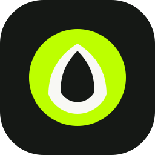

<p align="center">
  
</p>

<h1 align="center">AgentVegan pour ChatGPT Desktop</h1>

<p align="center">
  Recettes véganes, véganisation, menus, courses Picnic, restaurants et traiteurs véganes directement dans ChatGPT.
</p>

> **Compatibilité actuelle : application ChatGPT Desktop uniquement.**
> Ce plugin n’est pas encore installable dans ChatGPT sur le Web ou sur mobile.

> **État de la mise en service :** le dépôt est installable. Les recettes, la
> planification et la carte des restaurants utilisent déjà le MCP public. La
> connexion Picnic et le filtre dédié aux traiteurs sont présents dans cette
> version du plugin, mais nécessitent encore la prochaine publication protégée
> du MCP de production avant de fonctionner pour tous.

## Démarrage rapide

1. Installez puis ouvrez l’[application ChatGPT pour ordinateur](https://chatgpt.com/download/).
2. Dans ChatGPT, ouvrez **Codex** et démarrez une nouvelle conversation.
3. Copiez-collez exactement cette phrase :

```text
Installe ce plugin : https://github.com/ncleton/agentvegan-plugin
```

4. Acceptez l’installation lorsqu’elle est proposée, puis fermez complètement et relancez ChatGPT si l’application le demande.
5. Essayez par exemple : `Trouve-moi un restaurant végane près de moi.`

Il n’est pas nécessaire de connaître GitHub, d’utiliser le Terminal ou d’installer un serveur sur son ordinateur.

## Ce que le plugin permet

- chercher des recettes véganes et afficher leur fiche complète ;
- véganiser une recette ou remplacer un ingrédient d’origine animale ;
- créer une semaine de 21 repas à partir d’un profil alimentaire ;
- gérer une liste de courses ;
- connecter Picnic, prévisualiser un panier et l’ajouter uniquement après confirmation ;
- trouver des restaurants véganes à proximité ;
- trouver des traiteurs véganes pour un événement.

AgentVegan ne commande et ne paie jamais à la place de l’utilisateur.

## Comment cela fonctionne

Le dépôt contient le plugin et sa configuration MCP. Le plugin se connecte au service AgentVegan hébergé à l’adresse `https://mcp.agentvegan.org/mcp` : aucun serveur local n’est nécessaire.

Lorsqu’une fonction personnelle est utilisée, AgentVegan ouvre son parcours de configuration et d’authentification. La connexion Picnic est facultative. Les mises à jour du plugin sont distribuées depuis ce dépôt GitHub.

## Contenu du dépôt

```text
.agents/plugins/marketplace.json   Catalogue installable par Codex
plugins/agentvegan/.codex-plugin/  Manifeste du plugin
plugins/agentvegan/.mcp.json       Connexion au MCP AgentVegan hébergé
plugins/agentvegan/skills/         Instructions des parcours AgentVegan
plugins/agentvegan/assets/         Icône et catalogue public autorisé
```

## Confidentialité et sécurité

- aucun identifiant Picnic, jeton, cookie ou profil utilisateur n’est présent dans ce dépôt ;
- les connexions personnelles passent par l’authentification AgentVegan ;
- toute modification du panier demande une confirmation explicite ;
- la politique de confidentialité est disponible sur [agentvegan.org/confidentialite](https://agentvegan.org/confidentialite).

Pour signaler une vulnérabilité, consultez [SECURITY.md](SECURITY.md). Pour obtenir de l’aide, consultez [SUPPORT.md](SUPPORT.md).

## Limites actuelles

- l’installation GitHub du plugin fonctionne uniquement dans ChatGPT Desktop avec Codex ;
- ChatGPT Web et les applications mobiles ne prennent pas encore en charge ce mode d’installation ;
- Picnic doit être disponible pour le compte et la zone de livraison de l’utilisateur ;
- les résultats de restaurants et traiteurs dépendent des établissements vérifiés dans le catalogue AgentVegan.

## Licence

Aucune licence publique de réutilisation ou de redistribution n’est accordée pour le moment. Le dépôt est rendu public afin de permettre l’installation du plugin AgentVegan.
