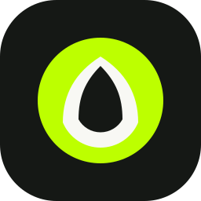

<p align="center">
  
</p>

<h1 align="center">AgentVegan</h1>

<p align="center">
  Recettes véganes, menus de la semaine, courses Picnic, Leclerc Drive et Carrefour Drive, restaurants et traiteurs véganes, avec Codex, Claude Code ou LibreAgent.
</p>

AgentVegan s'installe sur **votre** machine : votre ordinateur, ou votre propre
VPS. C’est elle qui calcule vos menus, exécute les connecteurs marchands et prépare vos courses. Le serveur AgentVegan conserve votre espace privé : profil, menus, listes,
recettes et photos. Une recette ne devient publique qu’après votre autorisation
et sa validation.

## Installation

Il faut une machine sous **macOS ou Linux** (Windows arrive bientôt). L'agent
installe lui-même Node.js s'il manque : vous n'ouvrez pas de terminal et vous ne
copiez aucun code.

**Avec Codex** (application ChatGPT pour ordinateur, onglet Codex, ou Codex en
ligne de commande), écrivez :

```text
Installe ce plugin puis installe AgentVegan sur cet ordinateur : https://github.com/ncleton/agentvegan-plugin
```

**Avec Claude Code**, ajoutez le catalogue puis le plugin :

```text
/plugin marketplace add ncleton/agentvegan-plugin
/plugin install agentvegan@agentvegan
```

puis écrivez « Installe AgentVegan sur cet ordinateur ».

**Avec LibreAgent**, installez le plugin depuis GitHub
(`https://github.com/ncleton/agentvegan-plugin`) sur l'ordinateur ou le VPS de
votre choix, connectez AgentVegan dans **Services connectés**, puis écrivez
« Installe AgentVegan sur cette machine ».

Ensuite, l'agent :

1. vous demande d'autoriser AgentVegan (un clic sur la page officielle) ;
2. associe la machine à votre compte, sans code à recopier ;
3. télécharge et vérifie le service AgentVegan, puis l'installe comme service
   permanent qui redémarre avec la machine ;
4. vous propose de connecter Picnic : vous saisissez vous-même vos identifiants
   et le code SMS sur une page sécurisée ;
5. vous propose de compléter votre profil, puis « Planifie ma semaine ».

La machine doit rester allumée pour calculer les menus et faire les courses.
Si elle est éteinte, AgentVegan l'indique (« En attente de votre ordinateur »)
et reprend dès qu'elle revient.

## Ce que le plugin permet

- chercher des recettes véganes et afficher leur fiche complète ;
- recevoir chaque jour les étapes illustrées des recettes prévues, avec un mode
  pas à pas, à l'heure choisie ;
- télécharger une recette ou les recettes du jour en PDF ;
- régler les notifications de l'agent (recettes du jour, semaine suivante) ;
- choisir ses essentiels du quotidien (pain, papier toilette…) et les retrouver
  dans le panier Picnic chaque semaine ou chaque mois, après validation ou
  automatiquement, sans jamais commander ni payer ;
- importer une recette vue sur Instagram en partageant simplement son lien, ou
  suivre une collection Instagram enregistrée et y ajouter chaque jour les
  nouvelles recettes ;
- garder ces recettes dans une collection perso classée comme sur
  agentvegan.org (catégorie, temps, sans gluten, nutrition par portion) et les
  retrouver dans les menus de la semaine ; elles sont aussi proposées à la base
  publique agentvegan.org, sauf si vous préférez les garder pour vous ;
- sauvegarder automatiquement chaque recette en PDF dans un dossier Google
  Drive, pour ne jamais les perdre ;
- véganiser une recette ou remplacer un ingrédient d'origine animale ;
- organiser les repas demandés : dîners seuls, déjeuners au travail, portions
  à congeler ou semaine complète, en conservant les aliments déjà choisis ;
- utiliser les recettes du site en priorité et créer une recette sur mesure
  avec votre accord lorsqu’elles ne conviennent pas ;
- proposer une nouvelle recette au partage après votre autorisation explicite :
  anonymement ou avec un pseudo choisi, et une photo de profil facultative.
  La recette reste privée pendant la validation AgentVegan ;
- choisir ses repas dans un calendrier de la semaine à quatre zones par jour
  (petit-déjeuner, déjeuner, quatre heures, dîner) : seules les zones cochées
  sont calculées, par exemple sept dîners et rien d'autre, ou une semaine
  complète de 28 repas ; le calendrier est mémorisé et réutilisé ;
- préciser la semaine dans la même phrase : « en priorité des recettes
  Instagram », « plein de tofu », « sans champignons », « 30 minutes max » ou
  « que des recettes de ma collection ». Les priorités sont placées autant que
  la nutrition le permet, les filtres sont appliqués avant le calcul, et
  l'agent indique combien de repas respectent réellement la demande ;
- gérer la liste de courses et la compléter chez Picnic, Leclerc Drive ou Carrefour Drive ;
- faire toutes les courses dans un Drive Leclerc ou Carrefour, papier toilette et
  produits d'entretien compris : un seul récapitulatif à valider, puis des
  ajouts contrôlés par la relecture du panier réel ;
- connecter un Drive Leclerc ou Carrefour dans le navigateur de la machine associée, puis lire son catalogue et son panier ;
- prévisualiser le panier Picnic et l'ajouter uniquement après confirmation ;
- trouver des restaurants et des traiteurs véganes selon une envie.

AgentVegan ne commande et ne paie jamais à votre place.

## Connecteurs marchands inclus

Tous les utilisateurs du plugin disposent des mêmes outils marchands via le
serveur AgentVegan. L’installateur inclut les connecteurs dans le service de
leur propre machine. Il n’y a pas de serveur MCP marchand supplémentaire à
ajouter manuellement à Codex, Claude Code ou LibreAgent.

| Enseigne | Liaison au plugin | Fonctions disponibles |
|---|---|---|
| E.Leclerc Drive | [Dépôt MCP Leclerc](https://github.com/ncleton/leclerc-drive-mcp) | Connexion, recherche, fiche produit, lecture et modification confirmée du panier |
| Carrefour Drive | [Dépôt MCP Carrefour](https://github.com/ncleton/carrefour-drive-mcp) | Connexion, recherche, fiche produit, lecture et ajout confirmé au panier |

Les dépôts MCP et leurs versions sont liés dans
[native-drive-connectors.json](plugins/agentvegan/native-drive-connectors.json).
Ce manifeste pilote les dépendances réellement installées. L’installateur
vérifie que le service distribué inclut toutes les capacités annoncées.
Les MCP d’achats Auchan et Supermarchés Match ne font pas partie de cette
livraison : les sources AgentVegan contiennent des collecteurs de catalogue
pour ces enseignes, sans outils MCP de panier.

Demandez par exemple « Connecte Leclerc Drive », « Connecte Carrefour » ou
« Prépare mon panier chez Leclerc ».
Chaque personne choisit son magasin exact et utilise son propre profil de
navigateur sur sa machine associée. Elle termine elle-même toute connexion ou
étape humaine sur le site officiel. Aucun compte ni choix de magasin n’est
partagé entre utilisateurs. L’agent vérifie la session et le magasin réellement sélectionnés avant les
lectures et modifications du panier.

Pour une installation existante, demandez « Mets à jour AgentVegan sur ma
machine associée », puis reconnectez AgentVegan dans les services connectés
si les nouvelles autorisations Drive sont demandées. Le plugin conserve
également les autres enseignes déjà présentes dans les fiches de recettes.

## Où s'exécute quoi

| Sur votre machine | Sur le serveur AgentVegan |
|---|---|
| Calcul des menus | Base de données du compte (profil, menus, listes) |
| Connecteurs Picnic, Leclerc Drive et Carrefour Drive | Adresse de connexion des agents (`https://mcp.agentvegan.org/mcp`) |
| Session Picnic, chiffrée avec une clé propre à la machine | |
| Modes de décision Laya et Luna | |
| Import Instagram : téléchargement, transcription audio locale, images | Réglages de la collection perso |
| Collection perso, PDF et envoi vers Google Drive | Recettes que vous choisissez de proposer à agentvegan.org |
| Session Instagram dans une fenêtre de navigateur dédiée | |

Votre mot de passe et votre code SMS Picnic ne sont jamais conservés. La
session Picnic reste sur votre machine.

Votre mot de passe Instagram n'est jamais demandé dans la conversation : vous
vous connectez vous-même dans une fenêtre dédiée, et seule la session reste sur
votre machine. Google Drive s'autorise avec un code sur google.com/device, et
AgentVegan ne voit que les fichiers qu'il crée dans son dossier.

## Modes de décision

AgentVegan classe les recettes selon vos goûts et rapproche les produits avec
l'un des trois modes :

- **Laya (gratuit)** : s'exécute sur votre machine, moins précis ;
- **Jev** : utilise votre clé TypeSafe personnelle, saisie uniquement sur une
  page sécurisée ;
- **Luna, réflexion faible** : s'exécute via Codex sur votre machine, avec
  votre abonnement.

## Contenu du dépôt

```text
.agents/plugins/marketplace.json        Catalogue installable par Codex
.claude-plugin/marketplace.json         Catalogue installable par Claude Code
plugins/agentvegan/.codex-plugin/       Manifeste Codex
plugins/agentvegan/.claude-plugin/      Manifeste Claude Code
plugins/agentvegan/.mcp.json            Connexion au serveur AgentVegan
plugins/agentvegan/native-drive-connectors.json  Dépôts et capacités des Drives
plugins/agentvegan/installer/           Installateur du service sur la machine
plugins/agentvegan/skills/              Parcours AgentVegan, dont l'installation
plugins/agentvegan/assets/              Icône et catalogue public
```

## Confidentialité et sécurité

- aucun identifiant Picnic, jeton, cookie ou profil utilisateur n'est présent
  dans ce dépôt ;
- le service installé sur la machine n'est téléchargé qu'après association à
  un compte, et son empreinte SHA-256 est vérifiée ;
- toute modification du panier demande une confirmation explicite ;
- la politique de confidentialité est disponible sur
  [agentvegan.org/confidentialite](https://agentvegan.org/confidentialite).

Pour signaler une vulnérabilité, consultez [SECURITY.md](SECURITY.md). Pour
obtenir de l'aide, consultez [SUPPORT.md](SUPPORT.md).

## Limites actuelles

- Windows n'est pas encore pris en charge.
- ChatGPT sur le Web ne peut pas installer le service sur une machine.
